# demo-springcloud-alibaba
SpringCloud Alibaba 套件落地实践

## 微服务架构的演进过程
### 单体架构设计图

- 优点：开发、部署、上线简单；
- 缺点：代码耦合严重、牵一发而动全身

### 单体架构的升级改进：垂直应用架构

> 垂直：单一的业务场景，例如：电商、外卖、音乐等等
{: .prompt-tip }

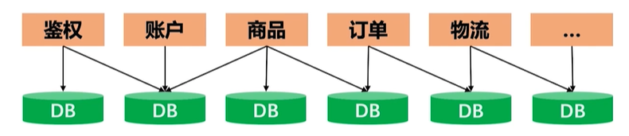

- 优点：服务、部署独立，水平扩展容易；
- 缺点：搭建复杂、服务之间关系错综复杂、维护困难

### 垂直应用架构的升级改进：SOA 架构
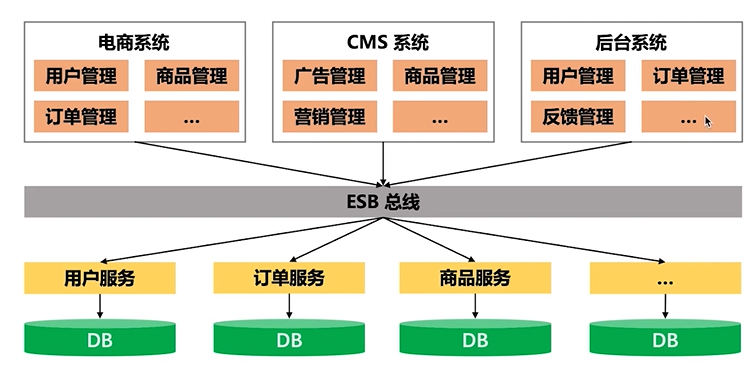


## 业界最流行的软件开发架构：微服务架构
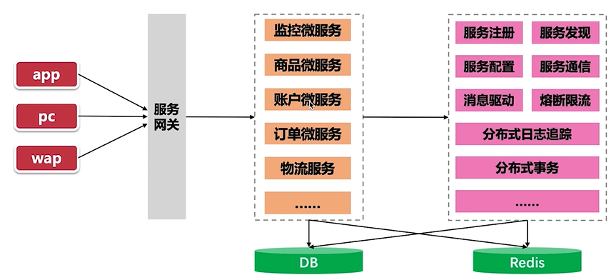

## 微服务架构遵循的原则


  - 合理、正确的将单体应用迁移到微服务（收益或优点）
    - 单个的微服务，可选择任意一个擅长的语言去开发、扩展性强
    - 对整个应用而言，代码不耦合，不会出现大量的冲突
    - 微服务可以重用，应用发布时间可控性更强
    - 通过故障隔离，让错误在微服务中降级，不会影响到整个应用（或其他服务）

### 不遵循微服务架构原则带来的问题

1. 微服务之间的依赖错综复杂（功能业务划分的不合理,存在大量交叉点），难以维护；
2. 开发过程【互相纠缠】，开发、上线时间严重影响
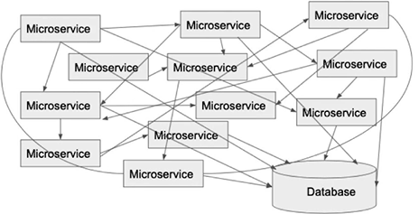

### 微服务架构需要遵循的原则

最佳实践：
1. 职责独立：每个微服务只做自己功能范围内的事情，微服务之间的依赖链不要【过长】
   
  > 建议单个微服务的依赖链路不要超过 3

  > 微服务的通信链路如果【太长】，就需要考虑重构，重新拆分微服务

  > 对通用的功能逻辑，如果不经常变更，做成 SDK，而不是一个服务

2. 使用熔断实现快速的故障容错和线程隔离，例如：`Hystrix`、`Sentinel`
3. 通过网关代理微服务请求，网关是微服务架构对外暴露的唯一入口
   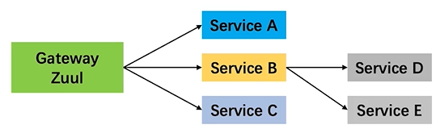
4. 确保微服务 API 变更后能够向后兼容

正确、合理的使用微服务会带来收益和成本的节省。如果前期不做优良的设计，成效差强人意。因此，在做微服务应用之前先不着急写代码，做实施，先将要做的事情、依赖、中间件以及工具梳理好，这是写出好代码、好的微服务架构设计（有可能）！


## 领域驱动设计（DDD）

DDD 相关概念：
- DDD 是一种软件架构设计方法，它并不定义软件开发过程（DevOps）
 
- DDD 利用面向对象的特性，以业务为核心驱动，而不是传统的数据库（表）驱动开发


领域：
- 领域是对功能需求的划分；大的领域下面还有许多小的子领域（理解领域，对功能需求、业务场景的理解）
 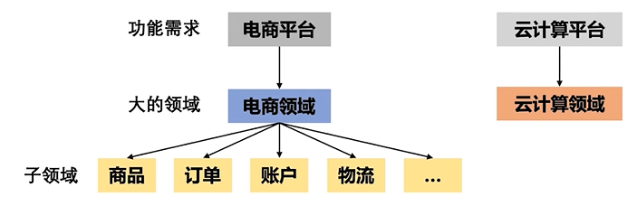

领域建模：
- 分析领域模型（搞清楚领域内的业务场景），推演**实体（需要的数据表）**、**值对象（服务之间用来传递数据的对象）**、**领域服务（编写的具体工程实现）**
- 找出聚合边界（合理的业务拆分、服务拆分，服务于服务之间不存在或存在极少的耦合，便于将来的系统维护，降低服务耦合）
- 为聚合配备存储仓库（数据持久化）
- 实践 DDD，不断推到、重构以及优化（考虑软件设计原则，包含性能等问题）

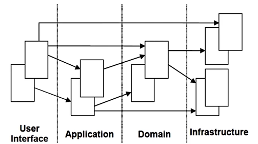
- User Interface
- Application
- Domain
- Infrastructure

传统软件开发习惯总是从设计数据表开始的，这种最大问题在于：前期数据表设计不合理，后期的改动则会非常大；而领域驱动设计最大的优势在于软件设计初期关注的是业务，而不是数据表，数据持久化只是设计后期的一个考虑。

没有最好的，只有最合适的。领域驱动设计只是一个流派，并不是完美无缺的，很多问题在实践中才会真正显露出来。就像微服务，虽然带来高内聚、低耦合，但也带来了系统复杂性，带来了服务管理和监控等问题。

实践领域设计，要灵活应变！！！

## 电商工程业务以及微服务模块拆分

### 电商功能业务解读

Tips: 学习领域知识最好的方式就是站在巨人的肩膀上。

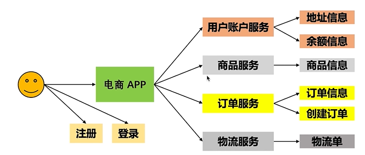


### 微服务模块拆分

1. 网关是微服务架构的唯一入口
   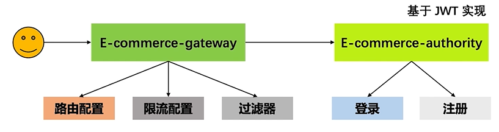
2. 电商功能微服务-四大功能微服务模块：账户、商品、订单、物流
   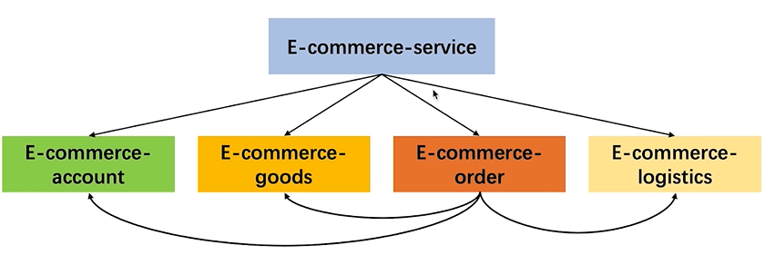
   之所以这样划分，`e-commerce-service` 功能微服务，还有 `e-commerce-account`、`e-commerce-goods`、`e-commerce-order`、`e-commerce-logistics` 子服务

合理的微服务划分需要考虑：
1. 按照业务划分，没有很多交集（最好没有）
2. 业务之间的依赖很少（很少需要分场景来看待），对于复杂系统，依赖必不可少，莫要过分纠结，即便前期版本规划设计并不完美，后期可以重构优化 ！！！

## Alibaba Nacos

- 服务、配置服务、名字服务
  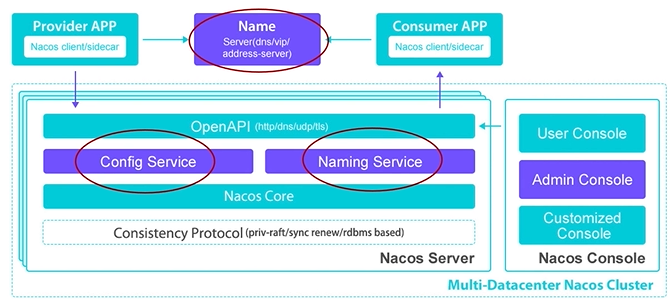
  - 服务：一个或一组软件功能，例如：特定信息的检索或一组操作的执行，目的是不同的客户端为不同的目的重用，如通过跨进程的网络调用。Nacos 支持主流的服务生态：K8s Service、gRPC、Doubbo RPC、SpringCloud RESTful Service(本工程的主要使用集成 nacos)
  - 配置服务：工程在运行过程中，可能需要一些动态的配置信息，例如元数据、数据库地址等等，此时就可以通过 Nacos 存储并管理这些配置信息，Nacos 对标 SpringCloud Config，不过比 Nacos 比 SpringCloud Config 更优秀！
  - 名字服务：服务注册和服务发现，是微服务架构下必不可缺少的功能。服务注册指的是微服务将自身的信息（例如，IP 地址、端口号、服务名称）注册到 Naocs 上进行绑定；而服务发现，则是其他的微服务提供一些信息，通过 Naocs 去寻找已经注册的微服务，因此能够实现微服务之间的互通互联

- Nacos Console：Nacos 为了方便用户使用，给用户提供的 Web UI，在完成 Nacos 的安装并启用之后，就可以通过浏览器打开这个 Console 页面，以可视化的方式查看配置信息、配置数据等等
- 服务注册中心：它是服务，实例以及元数据的数据库；服务注册中心可能会调用服务实例的健康检查 API 来验证它是否能够处理请求；
- 服务元数据：包括**服务端点（endpoints）**、**服务标签**、**服务版本号**、**服务实例权重**、**路由规则**、**安全策略**等描述服务的数据
- 服务提供、消费方：提供可复用和可调用服务的应用方；会发起对某个服务调用的应用方
- 配置：在系统开发过程中，通常会将一些需要变更的参数、变量等从代码中分离出来独立管理，以独立的配置文件的形式存在（其实，动态的配置是比较少的，通常情况下，只会把限流配置、路由配置一些信息存储到 Nacos 中）
### 部署 Alibaba Nacos 单机版本
作品遵循简单的原则

- 下载所需要的版本：https://github.com/alibaba/nacos/releases
- 解压：tar -xzvf nacos-server-2.0.0.tar.gz
- 单机模式启动（默认配置就可以）：./startup.sh -m standalone
- 访问路径：http://127.0.0.1:8848/nacos/index.html
- 默认的账号密码都是 nacos, 使用无痕模式吧

### 给 Nacos 配置自定义的 MySQL 持久化
```bash
### If use MySQL as datasource:
spring.datasource.platform=mysql

### Count of DB:
db.num=1

### Connect URL of DB:
db.url.0=jdbc:mysql://127.0.0.1:3306/nacos_config?characterEncoding=utf8&connectTimeout=1000&socketTimeout=3000&autoReconnect=true&useUnicode=true&useSSL=false&serverTimezone=UTC
db.user.0=root
db.password.0=root
```

### 部署 Alibaba Nacos 集群

1. 定义集群部署的 ip 和端口，即 cluster.conf 文件；
2. 集群必须要使用可以共同访问（例如 MySQL、PG 等等）到数据源作为持久化的方式
3. 集群化启动没有额外的参数：./startup.sh

```
# 进入到 /Users/brzha12/brzha_imooc/micro_service_solution/soft/nacos/conf, 新建 cluster.conf 文件, 并填充内容

172.16.3.41:8848
172.16.3.41:8858
172.16.3.41:8868

# 集群必须要使用 MySQL(可以是 PG 或者是其他的数据源)作为持久化的方式, 因为需要能够访问到同一个数据源

# 复制出来三份 Nacos
➜  soft cp -p -r ./nacos nacos-8848
➜  soft cp -p -r ./nacos nacos-8858
➜  soft cp -p -r ./nacos nacos-8868

# 修改端口号
vim nacos-8848/conf/application.properties
vim nacos-8858/conf/application.properties
vim nacos-8868/conf/application.properties

# 启动三个 nacos, 不带任何参数标识集群启动
./nacos-8848/bin/startup.sh
./nacos-8858/bin/startup.sh
./nacos-8868/bin/startup.sh
```

### Alibaba Nacos Client 服务注册与发现

#### Alibaba Nacos Client 的服务注册

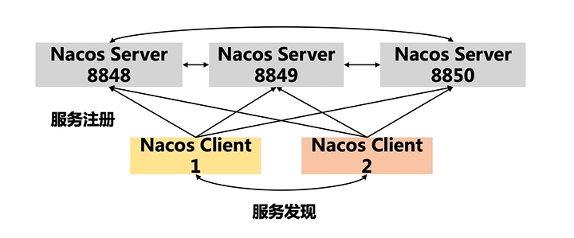
